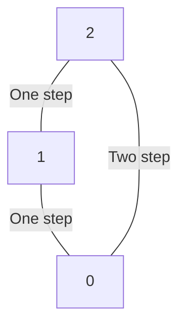
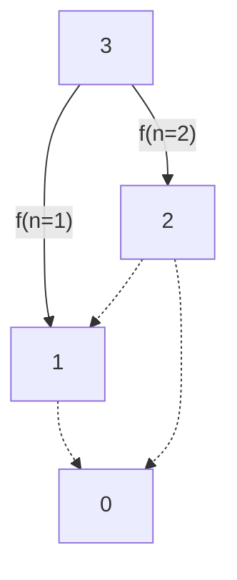

Dynamic programming is an optimisation solution. To identify if we can use dynamic programming to solve a problem, we need to answer the following two questions:

1. Can the problem be broken down into `optimal substructures`. I.e. is the larger problem composed of smaller problems of the same structure.
2. Can the problem be broken down into `overlapping subproblems`. This will be the memoization part.

Usually, there are two common dynamic programming methods:

1. `Top Down`: Start with the entire search space and use smaller components (subproblems) as needed to come up with a solution
2. `Bottom Up`: Start from the basic unit (sub-problem) and build up to the solution.

In each method, we leverage the `memoization` part to reduce the time complexity by caching previous results to avoid recomputations. I will dive right into examples because I think thats the best way to learn.

---

## Example: 

The problem we will work through is called [Climbing Stairs](https://leetcode.com/problems/climbing-stairs/). We are climbing a staircase and it takes `n` steps to reach the top. Each time you can either climb `1` or `2` steps. In how many distinct ways can you climb to the top?

Some small restrictions the question poses is that `n >= 1`. To make this clearer, for every step we take (either 1 or 2) we will subtract from `n` until we get to 0 which is assumed to be the top of the staircase.

Lets start by trying to explore how we would go about solving this manually for when `n` is small and then see if we can generalise any patterns for arbitary `n`. Suppose `n = 1`, well we can only take 1 step to finish. If `n = 2`, we could either jump 2 steps or we jump to step 1 and then we have can take 1 step again to finish so 2 solutions. 




Now lets consider `n = 3`. Well we could take one step and that would get us to `n = 2` (hold on, but we solved this already?). We could also take two steps and that would get us to `n = 1` (hold on, we solved this as well!). Here we've potentially identified our base cases, but more importantly we see there is overlapping subproblems. If only there was a way to store these results so we could later retrieve them as we wanted. Python ships with `functools` which has a decorator called `@cache` which will store these results for us. An alternative memoization method, would be to use a hashmap such as a dictionary and have the key being `n` with the result of the output being the value.

But lets first look at the `n = 3` case with a diagram:




The `f(n=1)` and `f(n=2)` steps are already computed. So the idea now becomes if I want to compute the number of ways for `n = 3`, we basically need to add all the ways we can climb a staircase when starting from `n = 1` and `n = 2` (subproblems). Likewise we can now store our result for `n = 3` and use this for larger values of `n` to break down the problem in the same way. So lets write this up in code:

```python
from functools import cache # Our memoization method


class Solution:
    @cache
    def climbStairs(self, n: int) -> int:
        # Base cases are for both n = 1 and n = 2
        if n == 1:
            return 1
        elif n == 2:
            return 2
        else:
            # In relation to our example above if climbStairs(n=3) then thats equal to the subproblems climbStairs(n = 2) + climbStairs(n = 1)
            # We can generalise this logic for arbitary n.
            return self.climbStairs(n - 1) + self.climbStairs(n - 2)
```


Hope you learnt something about top down methods in dynamic programming!