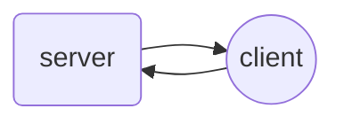

I attended a meet up the other day and found myself working on a task that involved the `websocket` protocol. I haven't used it much before and thought it would be a good opportunity to explore a small client vs server setup to see the basics of how it works. From my research, some of the avantages of using `websockets` over `REST`:

* Communication can be sent either way at any time during the lifetime of the `WebSocket` connection. Advantage over the hacky long-polling required with `REST` applications. 
* Client and server are continuously connected, data can be sent bidirectionally all the time. Whereas HTTP is strictly unidirectional protocol i.e. client requests data first before server sending data back.
* Simpler code to write up for this type of application using `websockets`.


> Key thing to remember is that a websocket is a persistent connection between client and server.
{: .prompt-info}

## Simple client vs server application

Best way to learn is with an example. We'll use the python websocket api and can be installed via pip

```shell
$ pip install websockets
```

The websocket API in python is built ontop of `asyncio`, hence uses coroutines inside of an eventloop to process the events asynchronously. You will see alot of `async def` keywords in this example.

For the case of simplicity, we'll avoid security but if you're interested on encrypting messages sent over websockets, there is a quickstart [here](https://websockets.readthedocs.io/en/stable/howto/quickstart.html#encrypt-connections).

A websocket connection is typically over TCP/IP, so we first need to define a `URI` for our client and server to communicate over. This is made up of the following:

```
ws://{address}:{port}
```

In our case: `address=localhost` and `port=8765`. In a production environment, you're address might be the ip of your server hosting your websocket.



### Client side

Here is our simple `client` side of our websocket application.

```python
import asyncio
import websockets
from websockets.client import WebSocketClientProtocol

# Client side of websocket application


async def handler(num1, websocket: WebSocketClientProtocol) -> None:
    await websocket.send(num1)
    resp = await websocket.recv()
    print(resp)

    

async def main():
    # Run an indefinite event loop
    while True: 
        num1 = input("Number: ")
        async with websockets.connect("ws://localhost:8765") as ws:
            # handler
            await handler(num1, ws)

if __name__ == "__main__":
    asyncio.run(main())
```

Here we have an indefinite process running (`while True`) that the user can input an integer. We then establish a connection with the uri `ws://localhost:8765`, inside the asynchronous context manager. The context manager returns a `WebSocketClientProtocol` that has methods such as `.send(message)` to server and `.recv()` data from the server. Other methods the object supports are listed [here](https://websockets.readthedocs.io/en/stable/reference/client.html#websockets.client.WebSocketClientProtocol).

### Server side

Here is our server side websocket application. We created a class `Server` to manage the multiple processes.

```python
import asyncio
import websockets
from websockets.server import WebSocketServerProtocol


class Server:

    _total = 0
    _clients = set()

    async def ws_handler(self, websocket: WebSocketServerProtocol) -> None:
        from_client = await websocket.recv()
        self._total += int(from_client)
        await self.register_client(websocket=websocket)
        print(f"Current total {self._total}")
        print(f"Current clients -> {self._clients}")
        await self.send_to_clients(
            message=f"Server records total={self._total}",
            websocket=websocket,
        )

    async def register_client(self, websocket: WebSocketServerProtocol) -> None:
        self._clients.add(websocket.remote_address)

    async def send_to_clients(self, message: str, websocket: WebSocketServerProtocol) -> None:
        await websocket.send(message)


async def main():
    server = Server()
    async with websockets.serve(server.ws_handler, "localhost", 8765) as ws:
        await asyncio.Future()

if __name__ == "__main__":
    asyncio.run(main())
```

There are a few moving parts to this code. The `main()` body is a coroutine that gets run in the eventloop (caused by `asyncio.run(main())`). Inside the `main()` coroutine, we have established a websocket server which is created from `websockets.serve()` method. We pass in 3 parameters, one is the `ws_handler` we want the server to execute, then followed by the `address` and `port` which makes up the `ws://{address}:port` URI our clients need to establish a connection to.

The handler does a couple things. If you look at the logic in `async def ws_handler`, you notice that it first recieves data from the client and then increments the total by that amount. It then prints to `stdout` the running total and also sends this message across to the clients so they are aware of the running total. And its as simple as that!

One more key point which is a bit of a headscratcher is what does the `await asyncio.Future()` object do. Well, this essentially keeps the event loop alive forever. Before, this was done with the `asyncio.run_forever()` method. Its important to distinguish here that it does not mean the coroutine will run forever. Thats why `run_forever()` doesn't accept an argument, because it doesn't care about any particular coroutine.


