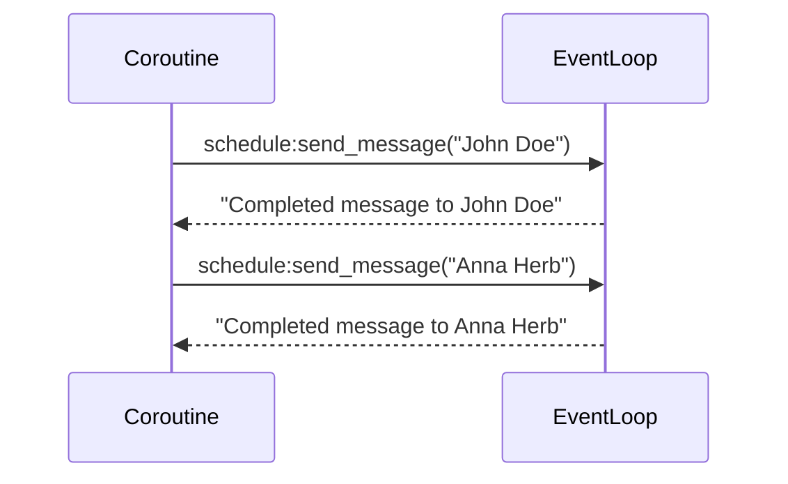
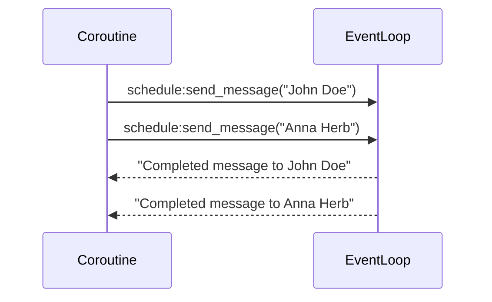

Aynchronous programming in python uses the `async def` and `await` syntax. 

> Asynchronous programming in python is still a *single threaded process* but reduces IO bound blockages in your application to improve performance
{: .prompt-tip}

## What are async functions in python

Fundermentally, they are [coroutines](https://docs.python.org/3/glossary.html#term-coroutine). These are more generalised form of subroutines (functions) that can pause the state of the operations before reaching the return statement. This helps to keep the python process working on other stuff while we are waiting for a response from an API (most common example).

---

## How not to use them

If I start by showing you how not best to use async functions then this should give an idea of how you **should** be using them.

```python
"""How not to use async"""
import asyncio 
import time

async def send_message(to: str):
    print(f"Sending message to {to}")
    await asyncio.sleep(2)
    print(f"Message sent to {to}")
    return f"Completed message to {to}"

async def main():
    # This is now behaving synchronously!
    # Total of 4 seconds
    start = time.time()
    sent_john = await send_message("John Doe")
    sent_anna = await send_message("Anna Herb")
    end = time.time()
    print(f"Time taken {end - start}s")

if __name__ == "__main__":
    asyncio.run(main()) # Approx 4 seconds
```

```shell
Sending message to John Doe
Message sent to John Doe
Sending message to Anna Herb
Message sent to Anna Herb
Time taken 4.001295328140259s
```

I'll explain the `asyncio.run()` method later on, but for now I want to focus of how I've defeated the purpose of what asynchronous brings to the table. 



The purpose is to run the `send_message` coroutine concurrently. As it stands, the `main()` coroutine first waits for the `send_message("John Doe")` to send successfully before `send_message("Anna Herb")`. 

## Lets to better by using *Tasks*

We would like for our thread to move on to another operation instead of waiting and sitting idle. In order to wrap these coroutines up to run them concurrently, we can create a [task](https://docs.python.org/3/library/asyncio-task.html#asyncio.create_task).

```python
async def main():
    start = time.time()
    # Wrap as tasks to schedule the coroutines concurrently in the event loop
    send_john_task = asyncio.create_task(send_message("John Doe"))
    send_anna_task = asyncio.create_task(send_message("Anna Herb"))
    await send_john_task
    await send_anna_task
    end = time.time()
    print(f"Time taken {end - start}s")

if __name__ == "__main__":
    asyncio.run(main())
```

The output now becomes

```shell
Sending message to John Doe
Sending message to Anna Herb
Message sent to John Doe
Message sent to Anna Herb
Time taken 2.0009560585021973s
```

So instead of our python process sitting around twiddling its thumbs, its moving on and running the next coroutine scheduled to be run. 

Note: Once we have wrapped the coroutine as a `Task`, then it is automatically scheduled to run soon.

An alternative and *newer* (v3.11) way of doing the above is by using a [TaskGroup](https://docs.python.org/3/library/asyncio-task.html#asyncio.TaskGroup) object as an asynchronous context manager. It allows for a convenient waiting for a group of related tasks. This might be because you want to batch a certain number of coroutines together. Adapting the above would look like:

```python
async def main():
    start = time.time()
    async with asyncio.TaskGroup() as tg:
      send_john_task = tg.create_task(send_message("John Doe"))
      send_anna_task = tg.create_task(send_message("Anna Herb"))
    end = time.time()
    print(f"Time taken {end - start}s")
```

The above constructs now schedule the tasks concurrently, hence the diagram now becomes



The `async with` statement will wait for all tasks inside the group to finish. Lets dive in a bit to see what python is doing behind the scenes at a higher level.  

---

## Tell me wtf is going on?

When python executes a coroutine thats been scheduled on the event loop it works its way down each step until it reaches an awaitable point in which it can *suspend* its state. Let me explain by using the example above:

```python
async def send_message(to: str):
    print(f"Sending message to {to}")
    await asyncio.sleep(2) # Suspend at this point
    print(f"Message sent to {to}")
```

At the point when `asyncio.sleep(2)` occurs, the coroutine is suspended and the pointer now moves onto another scheduled coroutine in the event loop. It will return to that point once that process has returned. A good example here might be that the coroutine waits on an external API to return some data, but in the mean time it will pause the state and point to another coroutine process in the event loop.

---

## What are awaitables?

Awaitables are objects that can be used in the `await` expression. There are typically 3 types of awaitable object:

* Coroutines (Good to know)
* Tasks (Good to know)
* Futures (Unlikely to work closely with)

Lets explore these further.

### Coroutines

To create a coroutine is as simple as using the `async def` construct. If you're familiar with generators, these are a kind of special type of generator due to their ability of suspending a state and then resuming at some future point. In contrast, subroutines (normal functions) will execute commands until a return statement is reached.

Heres an example:

```python
async def get_api(endpoint):
  return requests.get(endpoint)
```

Coroutines themselves are awaitables, so we can nest coroutines within other coroutines as long as we use them within an `await` expression. Here we run the above `get_api` coroutine inside a `main` coroutine.

```python
async def main():

  await get_api

if __name__ == "__main__":
  asyncio.run(main())
```


### Tasks

As explored further above, these are scheduled coroutines on the event loop. Try to think of these as a way of grabbing coroutines and setting up the framework so they can be run concurrently. Tasks have finer grain control than coroutines like cancelling a task, checking ready status.

NOTE: Concurrently in this context does **not** mean in parallel. Due to the `GIL` this is not possible in python (without some multiprocessing 3rd party tools).


We've mentioned above some of the ways to create tasks, i.e. either using `asyncio.create_task()` and then using the result inside the `await` so that we can wait until it completes or creating the tasks inside a asynchronous context manager such as ``TaskGroup()`` which is recommended in python 3.11. There was one other way using `gather()` which I will show below as I haven't mentioned it above:

```python
async def get_api(endpoint):
  return requests.get(endpoint)

async def main():
  # Create a list of coroutines
  coroutines = [get_api(endpoint) for endpoint in endpoints]
  # Add coroutines to be scheduled in the event loop
  await asyncio.gather(*coroutines)
```
---

## What is the event loop?

The event loop executes the scheduled co-routines (tasks) in a synchronous way. But the main take away is that it achieves its concurrency by skipping the blocking period of a co-routine by looking at any other co-routines in the event loop that can be executed. It does this by using a single thread! So make sure you understand asynchronous does **not** imply multithreaded process.

Theres a bunch of cool features in the `asyncio` library and I encourage you to read through it, however one function that caught my eye was `as_completed()`. This takes in a list of coroutines are returns an iterable of coroutines that can be awaited and the results can be consumed straight away as they are completed. This allows you to operate on them as they are completed instead of relying for the entire group of coroutines to complete (or fail).

```python
async def send_message(to: str):
    print(f"Sending message to {to}")
    await asyncio.sleep(2)
    print(f"Message sent to {to}")
    return f"Complete message to {to}"

async def main():
    start = time.time()
    coroutines = [
        send_message("John Does"),
        send_message("Anna Herb"),
        send_message("Chris Jakson"),
    ]

    # Returns an iterable coroutine that can be used with the await keyword
    # This means we can consume the result as it first completes inside a for loop and operate on the result

    for cor in asyncio.as_completed(coroutines):
        print(await cor)
```

### A bit about `asyncio.run()`

Typically you will interact with the higher level api in the `asyncio` library. The `asyncio.run()` is designed to run your top level entrypoint coroutine, such as `async def main()`. The execution of this coroutine in `asyncio.run()` will have the following flow:

* Create an event loop
* Runs the passed coroutine while managing the asyncio event loop
* Finalises all the dependent coroutines 
* Closes the threadpool

NOTE: the function cannot be called when another asyncio event loop is running in the same thread!

The previous low level api was using `loop = asyncio.get_event_loop()` and then having to close the event loop to clean up resources using `loop.close()` in a `try/except/finally` flow. We had two options for managing the event loops lifecycle (i.e. what the `asyncio.run()` function does). First option was to use `loop.run_until_complete(coroutine())` which would close once the coroutine had returned. Or we could have used `asyncio.run_forever()` which will keep the event loop alive in the thread until forcefully closed by the client using `asyncio.stop()`.

This would look something like this:

```python
async def do_something():
    print("Starting Work")
    time.sleep(5)
    print("Finishing Work")

loop = asyncio.get_event_loop()
try:
    loop.run_until_complete(do_something())
finally:
    loop.close()
```