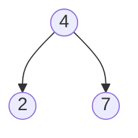
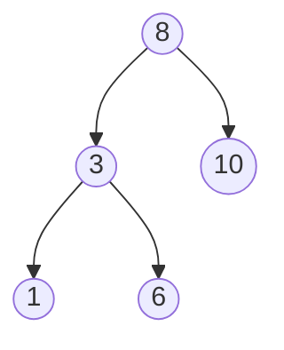
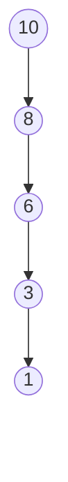

Let's start with a quick definition:

The property of a `binary search tree` is that the left child is always less than the current node and the right child is always greater than the current node.

An example is the following:

This meets the criteria because `2 < 4` and `7 > 4`.

**Note**: If there aren't exactly two children, the reference to the non-existant child will be `None`. 

---

## Insertion: From an array

Suppose we have the array `[8, 3, 10, 1, 6]`. We can start by inserting the root node as `8` and then traverse the array by inserting into the BST such that the property is maintained.

Tip: Lets say we were traversing the array above to build the BST and we have our next element `1`. We start at the current node `8` and decide that `1 < 8` so we should walk left. Then we reach `3` and decide `1 < 3` so we walk left again. We reach a `None` pointer and hence insert it here.

---

## Insertion: From a reversed sorted list

Suppose we have the sorted array `[10, 8, 6, 3, 1]`. After creating a BST from this array we are left with the following:

**Warning**: It is not desirable to have a linear binary search tree because it defeats the purpose. The time complexity is now reverted to O(N), which is far worse than the average BST case of O(LogN).

--- 

## Time complexities 

| Algorithm | Average Case | Worst Case|
| --- | --- | --- |
| Search | `O(LogN)` | `O(N)` |
| Insert | `O(LogN)` | `O(N)` |
| Delete | `O(LogN)` | `O(N)` |

The best way to avoid `worst case` is to avoid creating a linear binary search tree. There are some self balancing binary search trees which avoid this from occuring, known as [AVL tree](https://en.wikipedia.org/wiki/AVL_tree).