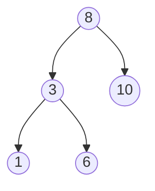
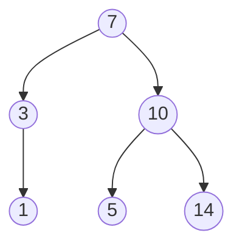

# Question

Validate if a `binary tree` satisifies the `binary search tree` property. 

### Example: Valid BST



### Example: Invalid BST



This is not valid because `5 < 7` and `5` belongs to the left subtree of `7`.


```python
class Node:

    def __init__(self, data):
        self.data = data 
        self.left = None 
        self.right = None  

def bst_validate(node, lower, upper):
    if not node:
        # Empty node is ordered correctly
        return True 

    val = node.data 

    if val <= lower or val >= upper:
        # Current node should be greater than all the values in the left subtree but also less than all the values of the right subtree
        return False


    if not bst_validate(node.right, node.data, upper):
        return False 

    if not bst_validate(node.left, lower, node.data):
        return False 
    
    return True 
```
