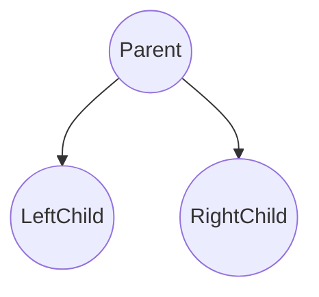
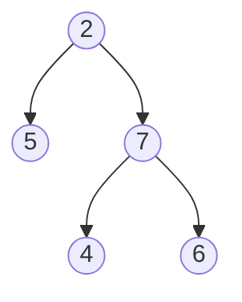
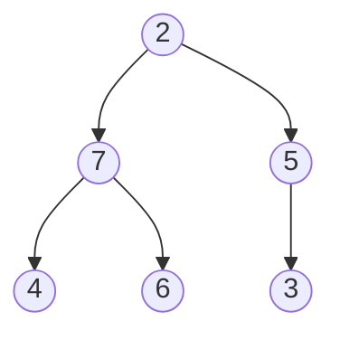
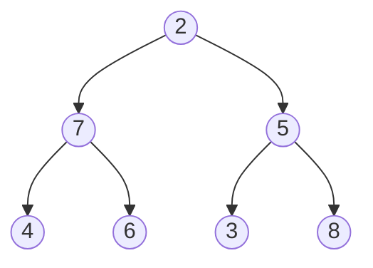

A binary tree is a complex data structure where each node can have at most two children (left and right).

--- 

## Finding depth & height 

Some definitions to get us started. The ``depth`` of a node is calculated as the total number of edges starting from the root node to the destination node.

The ``height`` of a tree is the path length from the root to the **deepest** descendent leaf. Idea is to find this path and count the number of nodes. You may recognise that ``height`` and ``depth`` are related.

**NOTE**: A single node binary tree has ``height = 1``

From the above we get:

* Height of Tree = 3  # this path is 2-7-6 or 2-7-4
* Depth node(5) = 1

---

## Types of binary trees

### Complete binary tree

Every level **except** possibly the last, is completely filled and all nodes in the last level start as **far left** as possible.

---
### Full binary tree 

A binary tree in which **every** node has either 0 or 2 children.

--- 

## Tree traversal

There are a few different types of tree traversal algorithms, each serving a different purpose for solving binary tree type questions.

They are split into two categories: `depth-first order` and `breadth-first order`.

1. Depth-first order
    - **In-order**: ``leftChild -> Parent -> rightChild``
    - **Pre-order**: ``Parent -> leftChild -> rightChild``
    - **Post-order**: ``leftChild -> rightChild -> Parent``
2. Breadth-first order
    - **Level-order**: ``nodesAtHeight1 -> nodesAtHeight2 -> ...``