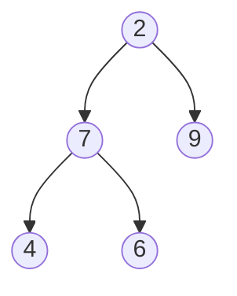

# Depth first search 

Lets consider a few examples of `depth first search` traversal algorithms. Here is the example binary tree.



First create our node object that we will use to create a tree structure.

```python
class Node:
    
    def __init__(self, value) -> None:
        self.value = value
        self.left = None 
        self.right = None 

# Initialise binary tree
root = Node(2)
root.left = Node(7)
root.right = Node(9)
root.left.left = Node(4)
root.left.right = Node(6)
```


## In-order traversal

Easiest way to remember this algorithm is that it visits the subtree like an upside down U. So `leftChild -> Parent -> rightChild`.

```python
def in_order(node: Node, traversal: str) -> str:
    if node:
        traversal = in_order(node.left, traversal)
        traversal += (str(start._value) + "-")
        traversal = in_order(node.right, traversal)
    return traversal

if __name__ == "__main__":
    in_order(root, "")

    # Assuming BT structure above we get
    # 4-7-6-2-9
```

## Pre-order traversal

Easiest way to remember pre-order is that we start with the current node before visiting left and right children. So `Parent -> leftChild -> rightChild`.

```python
def pre_order(node, traversal):
    if node:
        traversal += (str(start._value) + "-")
        traversal = pre_order(node.left, traversal)
        traversal = pre_order(node.right, traversal)
    return traversal

if __name__ == "__main__":
    pre_order(root, "")

    # Assuming BT structure above we get
    # 2-7-4-6-9
```

## Post-order traversal


Easiest way to remember post-order is that we visit children (left -> right) before parent. So `leftChild -> rightChild -> Parent`.

```python
def post_order(node, traversal):
    if node:
        traversal = post_order(node.left, traversal)
        traversal = post_order(node.right, traversal)
        traversal += (str(start._value) + "-")
    return traversal

if __name__ == "__main__":
    post_order(root, "")

    # Assuming BT structure above we get
    # 4-6-7-9-2
```

---
# Breadth first search 

This algorithm is useful for walking through a binary tree so that you visit all the nodes at **each level** before progressing to the next level.

## Level-order traveral

Lets still consider the binary tree above. We are tasked to walk through each level starting from the top level and progressively exhausting each level before moving down a level.

In order for us to perform a breadth first search, we require a `Queue`, which is a FIFO (first in first out) data structure.

```python
from queue import Queue

def levelorder_print(start):

    if start is None:
        return ""

    q = Queue()
    q.put(start)

    traversal = ""
    # Breadth first search, we exhaust the queue.
    while not q.empty():
        top: Node = q.get()
        traversal += f"{top.value}-"

        # add to the queue its left and right children

        if top.left:
            q.put(top.left)
        if top.right:
            q.put(top.right)

    return traversal
if __name__ == "__main__":
    print(levelorder_print(root))

    # 2-7-9-4-6
```

