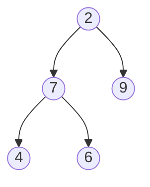

# Question

Write an algorithm that traverses the binary tree in reverse order from the bottom level to the top level. Consider the example:




Expected output `4-6-7-9-2`.

The solution leverages a `stack` to reverse the traversal performed by the breadth-first search of the `queue`.
```python
from queue import Queue

class Node:

    def __init__(self, value) -> None:
        self.value = value 
        self.right = None 
        self.left = None 


def reverseLevelOrder(root):

    if not root:
        return 

    stack = []
    queue = Queue() 

    queue.put(root)

    while not queue.empty():

        top = queue.get()
        stack.append(top)

        # Add right child before left
        if top.right:
            queue.put(top.right)
        if top.left:
            queue.put(top.left)

    # Once queue is exhausted we pop off all elements in stack and concatenate
    result = ""

    while stack:
        top = stack.pop()
        result += f"{top.value}-"

    return result
```