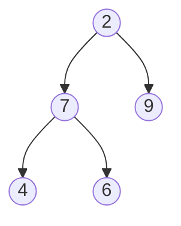

# Question

Given a binary tree, find the number of nodes it contains.

Consider the following input:



The expected output is `5`.


```python
class Node:

    def __init__(self, value) -> None:
        self.value = value 
        self.left = None
        self.right = None 

def size_of_tree(root: Node):
    if root is None:
        return 0

    return 1 + size_of_tree(root.left) + size_of_tree(root.right)
```
