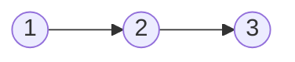

Linked lists are a linear data structure consisting of `Nodes` that hold both a data attribute and a next attribute (to which node it points to). The node class looks something like this:

```python
class Node:

    def __init__(self, data):
        self.data = data 
        self.next = None
```

Chaining Nodes together will form a linked list structure, where the `Head` node is the start of the linked list and the `Tail` node is the end of the linked lists.



> A terminating linked list will have `Tails` next pointer to `None`. In the above example `3` will point to `None`.
{: .prompt-info}

--- 
## Arrays vs Linked Lists

Here are some properties to compare linked lists with arrays.

|  | Array | Linked List|
| --- | ----------- | --- |
| Insert/Delete at beginning/end of array | O(N) | O(1) |
| Access Element | O(1) | O(N) |
| Contiguous memory | Yes | No |

There are clearly pros and cons for why you might want to use one data structure over the other. The issue with inserting into an array is that the array needs to be resized.

Suppose we had an array `[2, 4, 5, 6]` and we wanted to insert `1` at the front of the array we would need to shift all the elements currently in the array to the right by one space, hence an `O(N)` operation.

However, if we had the data structure `2 -> 4 -> 5 -> 6` as a linked list, all we would need to do is create a `Node(1)` and have it point to 2 i.e. `1 -> 2` and then change the head pointer to `1`. 

---
### Create a LinkedList class

We'll cover some basics in this tutorial such as creating a `LinkedList` class that has some of the most common methods.

A `LinkedList` instance should have an attribute `head` that should not be `None` if the `LinkedList` is not empty.

```python
class LinkedList:

    def __init__(self) -> None:
        self.head = None

    def append(self, data) -> None:
        new_node = Node(data)

        # In the event our linked list is empty
        if self.head is None:
            self.head = new_node
            return 

        # Else walk to the last node
        curr = self.head
        while curr.next:
            curr = curr.next
        
        curr.next = new_node
```

In the example above we've built the blueprint for the linked list. Here the `LinkedList` class has an `append(data)` method which takes in as parameter `data` and instantiates a `Node` object with that `data` parameter. It then checks to see if the linked list is empty (via checking `self.head`) and if so will assign the node object as the new head. Else, it will go to the last node in the list (i.e. the tail) and assign the next pointer to this new node created.

---
### Find length of linked list

This is a useful helper method for other methods that may follow. Its trivial in its logic so I'll let the code guide this one. I decided to write it in a recursive way to give a flavour of other techniques to traverse a linked list.

```python
    def length(self):
        def rec_length(node: Node):
            if node is not None:
                # Add 1 to each recursive call
                return 1 + rec_length(node.next)
            return 0
        return rec_length(self.head)
```


---
### Prepend linked list

Suppose we wanted to add extra functionality to our `LinkedList` class, such as a method that added a new node to the beginning of our linked list.

```python
    def prepend(self, data) -> None:
        new_node = Node(data=data)
        if self.head is None:
            self.head = new_node 
            return 

        # change the head pointer
        new_node.next = self.head 
        self.head = new_node
```

The above logic checks if the linked list is empty and if so add the node as head. If it's not empty, make the new nodes next pointer, point to the current head and then set the new node as the current head.

---
### Insert after node

The following method allows us to insert a node in a list directly after a target node.

```python
    def insert_after_node(self, prev_val, data):
        # Search to find existance
        curr = self.head

        while curr:
            if curr.data == prev_val:
                break
            curr = curr.next

        if curr is None:
            return "Not Found"

        # else we've found the previous node
        new_node = Node(data=data)
        new_node.next = curr.next
        curr.next = new_node
```

We need to be aware of the edge case that Node doesn't exist.

---
### Delete a node

Another popular operation on a linked list is to delete a node.

```python
    def delete_node(self, key) -> None:
        if self.head.data == key:
            # update head
            self.head = self.head.next
            return 
        # If not head, we need to scan through and find when then next node is the target node
        curr = self.head 

        while curr.next and curr.next.data != key:
            curr = curr.next 

        if curr.next is None:
            print("Cannot find key.")
            return 
        # Our curr is now the previous value, so delete node by removing link
        curr.next = curr.next.next 
```

Here we need to keep tabs of checking if the target node is the head or not. If its not the head we need to go the the prior Node we want to delete and "break the chain".

A good example of this is suppose we wanted to delete `Node(3)` from the linked list `1 -> 2 -> 3 -> 4`. We would need to go to `Node(2)` and change its next pointer to `Node(4)`.

Another common method for deleting, similar to the above, is deleting via an index element. The logic for that is as follows:

```python
    def delete_node_at_pos(self, pos):
        # Two cases: 
        # 1. Node deleted at pos 0
        # 2. Node deleted at pos not 0
        if self.head is None:
            raise IndexError("No head available.")

        if pos == 0:
            self.head = self.head.next 
        else:
            # We need to walk through and find the index
            curr = self.head 
            idx = 0
            while curr and idx < (pos - 1):
                curr = curr.next 
                idx += 1
            
            if curr is None:
                # Index is out of bounds
                raise IndexError(f"Out of range for index={pos}")
            # If current index exists we arrive at the node before the one we want to delete
            # So we can skip the index if it exists
            curr.next = curr.next.next
```