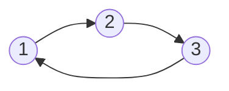

Circular linked lists are similar to singular linked lists, except the tail node now points *back* to the head node. This makes it slightly more trickier to traverse because we don't ever reach a terminating value.

Lets consider our `Node` class as before:

```python
class Node:
    
    def __init__(self, data) -> None:
        self.data = data 
        self.next = None
```

Here is an example of a circular linked list, notice where the tails next pointer references.



> A circular linked list always has the `Tails` next pointer to `Head`.
{: .prompt-info}

We will start off by constructing a `CircularLinkedList` class. Like in the singular linked lists, lets add an `append()` and a `prepend()` methods.

---
## Appending

```python
class CircularLinkedList:
    
     def __init__(self) -> None:
        self.head = None 

    def append(self, data: int) -> None:
        node = Node(data)
        if not self.head:
            self.head = node 
            self.head.next = self.head # circular
        else:
            curr = self.head 
            while curr.next != self.head:
                curr = curr.next 

            curr.next = node 
            curr.next.next = self.head 
```

For the `append()` method we initialise a new `Node(data)` class with the required data being passed in. There are two scenarios to check fore:

1. If the list is empty (i.e. self.head is None)
2. If the list is non-empty, get the tail node.

In the case of 1, we just assign the new node as a head node and then have the next pointer reference itself. In the case of 2, we traverse the list carefully checking that our `curr.next != self.head` so that we can stop at the tail node (remember this is where circular linked lists differ from singular linked lists).

Once we have the tail node, we need to update in the following way:
1. Change `current_tail` -> `Node(data)`
2. Have `Node(data)` -> `curr_head`.

By doing this we've added our new tail using our current node and moved its next pointer to circulate back to head.

---
## Prepending

```python
class CircularLinkedList:
    
     def __init__(self) -> None:
        self.head = None 
    
    ...

    def prepend(self, data: int):
        node = Node(data)

        if not self.head:
            self.head = node 
            self.head.next = self.head

        else:
            curr = self.head
            while curr.next != self.head:
                curr = curr.next

            # curr now points to tail
            node.next = self.head
            curr.next = node 
            self.head = node
```

Prepending now works in the opposite direction to append. We need to insert a new `Node(data)` at the head. So like before we check the following conditions:

1. If the list is empty (i.e. `self.head` is `None`)
2. If the list is non-empty, get the tail node.

If you noticed in the last tutorial for singular linked lists, we didn't *need* the tail node to prepend. The is because singular linked lists are terminating i.e. the tails next pointer is `None`. However, for circular linked lists, we need the tail to now reference our new head, hence we need it available when making modifications to the data structure.

Essentially, we now have our new `Node(data)` next pointer referencing our current `self.head`. Then we get our tails next pointer, to pointer to the new `Node(data)`. Finally, we finish off by changing our `self.head` reference pointer to the new `Node(data)`.

---
## Remove

In this example, lets add a `remove(key)` method to our circular linked list. We'll make the assumption that the key we are looking for is stored in the linked list somewhere and the data values are in all nodes unqiue. Hence, our `remove(key)` will delete the first occurance of that node.

```python
class CircularLinkedList:
    
     def __init__(self) -> None:
        self.head = None 
    
    ...

    def remove(self, key: int) -> None:
        curr = self.head 
        while curr.next.data != key:
            curr = curr.next 

        curr.next = curr.next.next
```

The logic is fairly simply, we need to get to the penultimate node of our target node (i.e. target being equal to the key we want to remove). Then we break the Node from the linked list by skipping. This means we assign the previous nodes next node, to the node that follows from our target node.

For example consider `3 -> 4 -> 5 -> 6` and our target was `5`. We would get to node `4` and then move its next pointer to `6` i.e. `4 -> 6`.

---
## Validating a circular linked list

We will finish off this tutorial by exploring how to validate that a linked list is circular. There are a few ways of doing this, but I want to explore a way that I found uses O(1) constant space complexity. Our input will be a head node.

```python
def is_circular_linked_list(self, node: Node):
         # initialise fast and slow pointers
        slow = fast = node.head

        while fast and fast.next:
            slow = slow.next 
            fast = fast.next.next
            if slow == fast:
                return True 
        return False
```

We first need to evaluate two possible outcomes:

1. The linked list is terminating -> Not a circular linked list
2. The linked list is circular.

To evaluate 1, we need to breakout of the while condition, this happens by checking the eventual next pointer of fast being `None`. For 2, we use a clever trick by using two pointers `slow`, `fast` which traverse the list at different paces (i.e. fast skipping a node) eventually meeting if the list is circular.

Thats all for this post, hope you enjoyed the content!