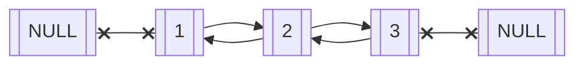

We now extend the [singly-linked-list](https://tiri1992.github.io/posts/singly-linked-lists/) tutorial to explore a linked list where we have bidirectional traversal. This is known as a `doubly linked list` and it requires us to adapt our node instance to now have `prev` property to traverse in the opposite direction.

```python
class Node:

    def __init__(self, data) -> None:
        self.data = data
        self.next = None
        self.prev = None
```

Lets take a look at an example of the structure of a doubly linked list:



So the key thing to note here is that `head.prev = None` and `tail.next = None`. We need to account for this when modifying the data structure.

---
## Appending & Prepending

We will start by first implementing a `DoublyLinkedList` class and create two methods, `append` and `prepend`. The `append` method will add a node to the end of the list (i.e. become the new tail) and `prepend` will add a node the beginning of the linked list (i.e. become the new head). 

```python
class DoublyLinkedList:

    def __init__(self) -> None:
        self.head = None 

    def append(self, data):
        new_node = Node(data)
        if self.head is None:
            self.head = new_node
            return 
        # We need to get to the tail node
        curr = self.head 
        while curr.next:
            curr = curr.next 

        curr.next = new_node
        # We also need to point the other direction for new_node (i.e. prev = old tail node)
        new_node.prev = curr 

    def prepend(self, data):
        new_node = Node(data) 
        if self.head is None:
            self.head = new_node
            return 
        
        new_node.next = self.head
        self.head.prev = new_node
        self.head = new_node

    def print_list(self):
        curr = self.head 

        while curr:
            print(curr.data, end=" ")
            curr = curr.next
```

We have two cases to look out for:

* Case 1: Our linked list is empty, in which case `append` or `prepend` will become the new head
* Case 2: Our linked list is not empty, then for `append` we need to traverse to the very end of the list. The `prepend` we need to reassign the new_node as head.

---
## Add Node before or after key

We will assume for this section that the key we would like to add a node after or before actually exists. Lets break down some of the scenarios of adding a node `before` a key:

* Case 1: The node is a head node. Hence we can call the `.prepend()` method we created.
* Case 2: The node is not head node.

```python
    def add_node_before(self, key, data):
        new_node = Node(data)
        curr = self.head 
        while curr:
            if curr.data == key and curr == self.head:
                # call prepend
                self.prepend(data)
                return 
            elif curr.data == key:
                # Found the node we need to append before
                prev = curr.prev
                prev.next = new_node
                new_node.next = curr
                new_node.prev = prev 
                curr.prev = new_node
                return 
            curr = curr.next
```

Notice here that we rearrange the pointers in such a way that the previous node is now pointing to our new node and the current node is being referenced as `next` from our new node. We then need to rearrange the `prev` pointers to respect this new change.

Lets look at the implementation of adding a node after key:

```python
    def add_node_after(self, key, data):
        new_node = Node(data)
        # traverse to the key (assuming it exists)
        curr = self.head 
        while curr:
            if curr.next is None and curr.data == key:
                # tail node
                self.append(data)
                return 
            elif curr.data == key:
                next_node = curr.next 
                curr.next = new_node
                new_node.prev = curr
                new_node.next = next_node
                next_node.prev = new_node
                return 
            # continue walking
            curr = curr.next
```

We have to take care in the event the key points to the tail node here hence the check `curr.next is None`. Otherwise, we proceed as normal to rearrange the pointers so that the curr node now has next node pointing to the new_node and the `new_node.next` points to what was the `curr.next` node. Likewise, we rearrange the `prev` pointers as well.

---
## Deleting a node

For this example, we'll assume that the key we want to delete actually exists. Lets have a look at the implementation.

```python
    def delete(self, key):
        # Assume the key exists
        curr = self.head
        while curr:
            if curr.data == key and curr == self.head:
                # remove head only
                self.head = None 
                return 
            elif curr.data == key and curr.next is None:
                # Just remove the next pointer of the previous element
                curr.prev.next = None
                return 
            elif curr.data == key:
                curr.prev.next, curr.next.prev = curr.next, curr.prev
                return 
            curr = curr.next
```

There are 3 cases we have to be aware of when deleting a node:

* Case 1: If the node is a head node. In this case we can rearrange the new head to be the current head.next
* Case 2: If the node is a tail node. We will need to set the penultimate node as the new tail node.
* Case 3: Somewhere inbetween head and tail. For this we do some python gymnastics and have the previous pointers next property skip the current node. And rearrange the prev pointers in such a way that it skips the target node.

---
## Reverse a linked list

Lets have a look at creating a method for reversing our linked list. This one is a bit tricky, because we need to take care of both directions (`next` and `prev`).

```python
    def reverse(self):
        # Reverse the pointers at each node
        curr = self.head 
        while curr:
            if curr.next is None:
                self.head = curr
            # Store the next node in a temp variable so we can traverse after modifying
            tmp = curr.next
            curr.next, curr.prev = curr.prev, curr.next
            curr = tmp
```

When we reverse the linked list, its important to remember that our current `head` will become our new `tail` and vice versa. So we will need to reflect this. I've changed the head pointer at the end of the traversal so we don't have to do that on each iteration. Another step to be cautious about is storing the `next` property in a temporary variable. This is because once we swap the `next`, `prev` pointers around, we lose the reference to the next node and unless we store this somewhere, would be impossible to traverse to this node.

---
## Remove duplicates

Now what if we wanted to reduce any duplicate nodes in our doubly linked lists? There are a few ways we could solve this problem, but I'm going to go with what I beleive is the most straight forward, using hash (or `set()`) to store the seen values to know if the current value is a duplicate.

```python
    def remove_duplicates(self):
        # Cache the seen keys
        seen = set()
        curr = self.head 
        while curr:
            if curr.data in seen:
                if curr.next and curr.prev:
                    # Neither tail/head
                    tmp = curr.next
                    prev = curr.prev 
                    prev.next = curr.next 
                    tmp.prev = prev
                    curr = tmp 
                    continue
                elif curr.next:
                    # head
                    self.head = curr.next 
                    self.head.prev = None 
                    curr = curr.next 
                    continue 
                else:
                    # Tail
                    curr.prev.next = None 
                    return

            seen.add(curr.data)
            curr = curr.next
```

We first create a `seen` hashtable to store any keys we've currently seen to know if a duplicate has occured. Then as we traverse the linked list we add to it. The checks inside the `while` loop are if we've seen the current key, to identify what position its at. There are 3 cases for this:

* Case 1: If we are the tail.
* Case 2: If we are at the head.
* Case 3: If we are somewhere in between (`if curr.next and curr.prev`)

The deletion of this node is very similar to logic implemented in the `.delete()` method.

---
## Two sum 

We'll finish off this post by implementing a solution to the two sum problem using our newly found data structure. The problem is to find all pairs of numbers that sum to a particular target value (`sum_value`). To do this we utilise a `set()` to store the values currently seen and see if we've already visited the value `sum_value - num`, then we can have the pair `(num, sum_value - num)` appended to our results. Once we get to the end of the linked list, we return the list of tuple which hold the results.

```python
    def two_sum(self, sum_value):
        seen = set()

        results = []
        curr = self.head

        while curr:
            num = curr.data 
            if (sum_value - num) in seen:
                results.append((num, sum_value - num))
            
            seen.add(num)
            curr = curr.next
        return results
```

Thats all for this post, hope you learn't something new about doubly linked lists. The main take away here is that the doubly linked lists has an extra `prev` property to be aware of. Once you aware of that extra property, the logic of manipulating the data structure is quite similar to that of a singly linked list.