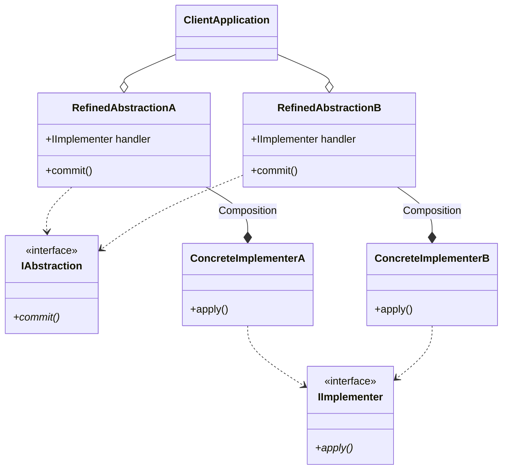
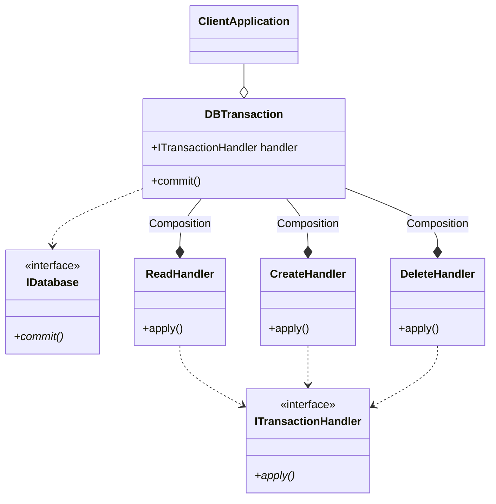

If you've ever been working on a python project and find yourself compiling a bunch of `if` statements, chances are theres a design problem somewhere in your code. As python is one of the most flexible languages, I've noticed design patterns is often overlooked in favour of rapid development. 

I had some inspiration from reading [Brandon Rhodes](https://python-patterns.guide/) blog on design patterns in python and felt I wanted to expand on some of the gang of four design principles. The main takeaway of this book is to  


> *Favor object composition over class inheritance.*
{: .prompt-tip}

I recommend having a read on the class explosion issue. For this tutorial I want to give a quick example of how the `bridge` pattern can be implemented in python and how this design pattern can be a good fit for some design problems.

---
## What is the bridge pattern?

The bridge pattern is a structural design pattern. Structural design patterns deal with the composition of classes and objects. The focus of the bridge pattern is to **separate** the abstraction from its implementation, allowing you to extend implementations instead of modifying them (heard this before? Dam right, this is one of the principles from `SOLID` - open closed principle).

Lets get the UML diagram out of the way first:



As you can see, there is a clear separation of `Abstractions` vs `Implementations`, and the client can compose this as they wish at runtime to create complex interactions whilst avoiding the class explosion you get from inheritance. This split also allows us to adhere to the single responsibility principle because each `Implementation` should do one thing. As our `Abstraction` signature takes in a `IImplementer` interface, we can extend to multiple different implementations are our application grows more complex, whilst getting the security that the signature of our implementation remains consistent because of its interface.

One of the drawbacks with the bridge pattern is that its primarly used to refactor *existing code*. If you cannot modify the code e.g. because it belongs to some 3rd party library but you want to adapt your code to fit that specific interface, the `Adapter` design pattern is more suitable (for a future blog post).

---
## Example with FastAPI

I want to give a concrete example. In this example, we attempt to refactor a few endpoints of a FastAPI implementation that does some kind of transaction to a database. To keep the example simple, I've decided to use a container object to act as an in memory database. Lets take a look:

```python
from fastapi import FastAPI, status
from pydantic import BaseModel

app = FastAPI()

# In memory container
db = [
    {
        "user_id": 1,
        "task": "take the bins out",
    },
    {
        "user_id": 2,
        "task": "clean bathroom",
    }
]

# Schemas
class TaskRequest(BaseModel):
    
    user_id: int 
    task: str


@app.get("/tasks/{user_id}")
def get_tasks(user_id: int):
    res = [ 
        data for data in db if data.get("user_id") == user_id
    ]
    return res 

@app.post("/tasks", status_code=status.HTTP_201_CREATED)
def add_task(body: TaskRequest):
    db.append(body.dict())
    return body.dict()

@app.delete("/tasks", status_code=status.HTTP_204_NO_CONTENT)
def delete_task(body: TaskRequest):
    if body.dict() in db:
        db.remove(body.dict())

```

I've kept the endpoints very trivial so we can focus on the refactoring element in this post. The general notion of this simple application is that it has 3 path operations:

* `GET /tasks/{user_id}` -> response is all tasks for a specific `user_id`
* `POST /tasks/` body -> adds a new task to database
* `delete /tasks/` body -> removes a task from database if exists

This might not seem an issue, but one thing to notice is that the logic is closely coupled within the path operations. As this logic grows and the number of endpoints increase that follow a similar objective (i.e. read, write, delete from database) then we will get a lot of repeated code, which becomes harder to test and manage.

Okay, so how do I propose to implement a bridge pattern here? Well one thing to notice is that these operations are actual implementation handlers. So the client should be free to pick handlers that either: Read, Create or Write. Say we wanted to write to the database, well the client should be able to combine a refined abstraction (say DBTransaction class) with the desired concrete implementation (CreateHandler) and call the abstraction to `commit()`. The `commit()` should persist down and call the `apply()` of the implementation. Notice I used the methods `commit()` and `apply()` but this is by choice for the context of this tutorial. This can be any verb that describes the action: `emit()`, `persist()` etc. 

Lets first look at the `UML diagram` to give us a bit of context of these concrete classes and then look at the python code.



The diagram above shows the separate between our handlers, `ReadHandler`, `CreateHandler`, `DeleteHandler` and the `DBTransaction` abstraction that calls the handlers. In python, we don't have a built in interface object so we use an `Abstract Base Class` to mimic this property.

```python
from abc import ABC, abstractmethod

# Abstraction Interface: DB 
class IDatabase(ABC):

    @abstractmethod
    def commit(self):
        pass 

# Implementer Interface
class ITransactionHandler(ABC):

    @abstractmethod
    def apply(self):
        pass 

# Refined Abstractions
class DBTransaction(IDatabase):

    def __init__(self, handler: ITransactionHandler) -> None:
        self._handler = handler 

    def commit(self) -> list | dict | None:
        return self._handler.apply()

# Concrete Implementation: One for every different transaction type
# SRP and OCP met by the handlers being separate implementation. Much easier to test.
class ReadHandler(ITransactionHandler):

    def __init__(self, db: list, user_id: int) -> None:
        self._db = db 
        self._user_id = user_id

    def apply(self) -> list:
        return [ 
            data for data in self._db if data.get("user_id") == self._user_id
        ]

class CreateHandler(ITransactionHandler):

    def __init__(self, db: list, body: TaskRequest) -> None:
        self._db = db 
        self._body = body 

    def apply(self) -> dict:
        self._db.append(self._body.dict())
        return self._body.dict()

class DeleteHandler(ITransactionHandler):

    def __init__(self, db: list, body: TaskRequest) -> None:
        self._db = db 
        self._body = body 

    def apply(self) -> None:
        if self._body in self._db:
            self._db.remove(self._body.dict())
```

Now the code inside the path operations simplify, you should be able to notice a clear pattern in the construction of composing the implementation with the abstraction.

```python
@app.get("/tasks/{user_id}")
def get_tasks(user_id: int):
    # Create an object from our Abstraction: DBTransaction 
    # and pass in one of our concrete implementations, in this case the Read Implementation
    taskdb = DBTransaction(
        handler=ReadHandler(
            db=db,
            user_id=user_id,
        )
    )
    # Client can guarentee a consistent interface with .commit() 
    return taskdb.commit()
    

@app.post("/tasks", status_code=status.HTTP_201_CREATED)
def add_task(body: TaskRequest):
    taskdb = DBTransaction(
        handler=CreateHandler(
            db=db,
            body=body,
        )
    )
    return taskdb.commit()

@app.delete("/tasks", status_code=status.HTTP_204_NO_CONTENT)
def delete_task(body: TaskRequest):
    taskdb = DBTransaction(
        handler=DeleteHandler(
            db=db,
            body=body,
        )
    )
    return taskdb.commit()
```

Unittests are as simple as testing each handler in isolation. This also lends itself quite nicely to `TDD` (for a future post), as if I wanted to go ahead and create an implementation `UpdateHandler(ITransactionHandler)`, we can go ahead and write the failing tests first and then add the neccessary logic to make it pass.

I hope you enjoyed this post, I will attempt to write up more design patterns I think are useful in python over time.